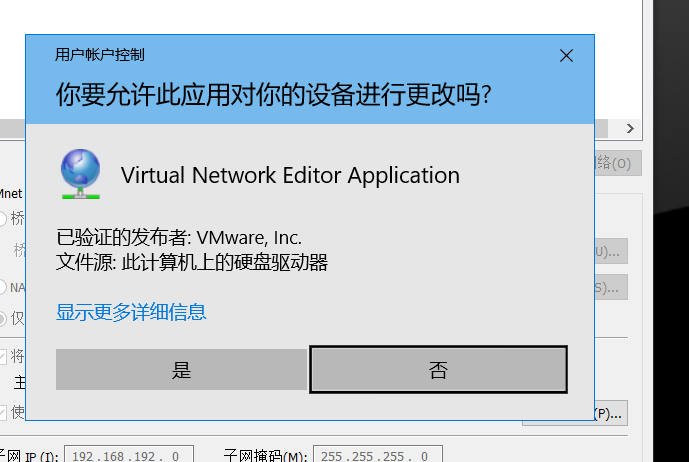

### 1 自行安装 vmware workstation

-----------------

### 2 还原 wware 网络 

##### 打开 vmware workstation 点击 编辑 -> 虚拟网络编辑器 如下图


##### 点击更改设置


##### 点击是



##### 点击还原默认设置


##### 点击 是


##### 点击确定


### 3 自定义vmware 网络

##### 打开 vmware workstation 点击 编辑 -> 虚拟网络编辑器 如下图


##### 点击更改设置


##### 点击是


##### 点击 上面  VMnet8


##### 在使用本地DHCP.... 子网处填写自定义的子网 172.16.10.0 如下图 并点击确定


##### 点击确定

#### 测试自定义网络位分配的ip 

```
本机还有一个网卡 叫VMnet8 地址为172.16.10.1  我们用这个地址和 172.16.10.0/24 段的虚拟机进行通信   虚拟机的网关默认是  172.16.10.2
```


