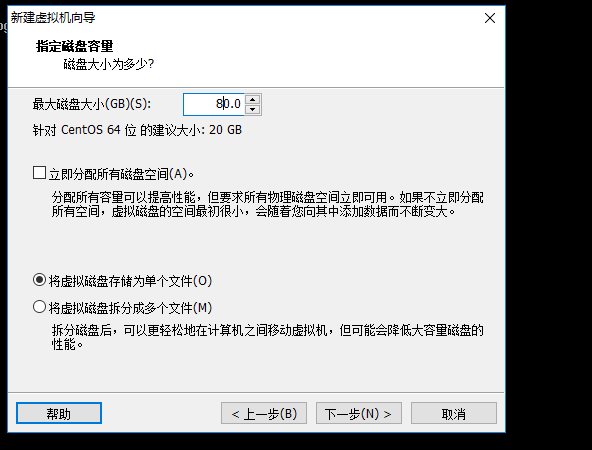
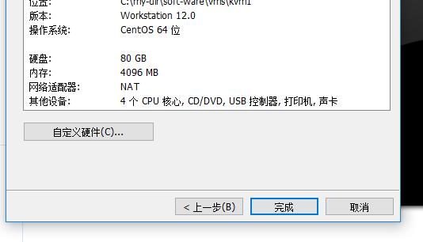

### 在vmware workstation 中安装一个虚拟机

这个虚拟就是我们学习kvm虚拟化的学习环境 

那么我们首先呢 先做准备一下这个学习环境 

##### 1 打开vmware ->文件-> 新建虚拟机 
------------------

##### 2 选择 自定义(高级) -> 下一步  如下图

-----------------------------

#####  选择虚拟机硬件兼容性(直接默认的) -> 下一步 

------------------------------------

#####  稍后安装操作系统 -> 下一步  
--------------------------------

#####  选择客户机操作系统   Linux (版本 CentOS64 位) -> 下一步 

-------------------------

##### 虚拟机名字(kvm1) -> 下一步 

--------------------------------

#####  处理器 (处理器数量 2 每个处理器的核心2 即可)  -> 下一步

------------------------------------

##### 内存 4096MB  ->  下一步 
--------------------------

##### 网络类型   使用网络地址转换 

--------------------

##### 选择I/O控制器类型  选择默认的 (LSI  logic) -> 下一步 

-------------------

##### 选择磁盘类型 选择默认的 SCSI(S)  ->  下一步 

------------------------------

##### 选择磁盘 创建新磁盘  -> 下一步 
-----------------------

####  最大硬盘大小 80G 将虚拟磁盘存储为单个文件  -> 下一步   如下图 

-----------------------------

##### 下一步  指定磁盘文件  默认即可  ->  下一步

---------------------

##### 点击自定义硬件   (不要点击完成)如下图

##### 处理器  (虚拟化Intel VT-x/EPT 或 AMD-V、RVI，虚拟化CPU性能计数器)

##### 新DVD ->  使用ISO映像文件 -> 浏览  CentOS-7-x86_64-DVD-1804.iso -> 打开 -> 关闭

##### 点击完成

